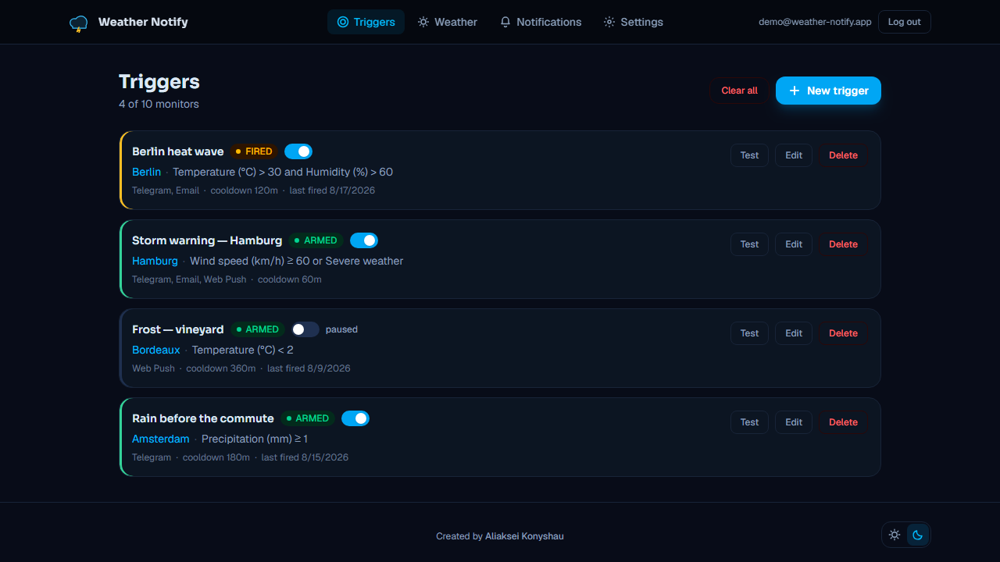
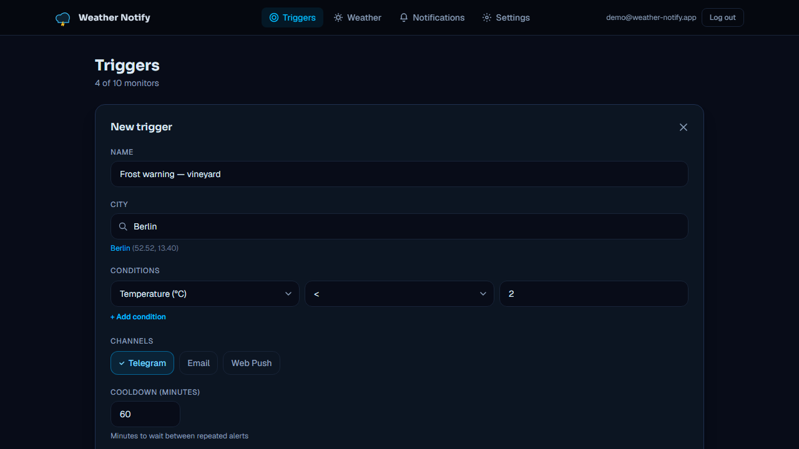
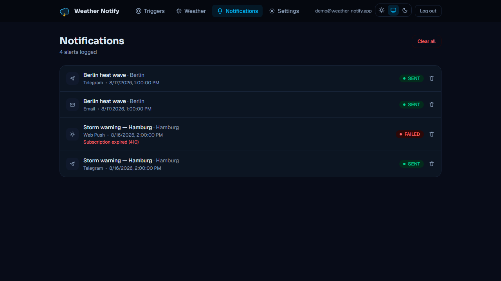
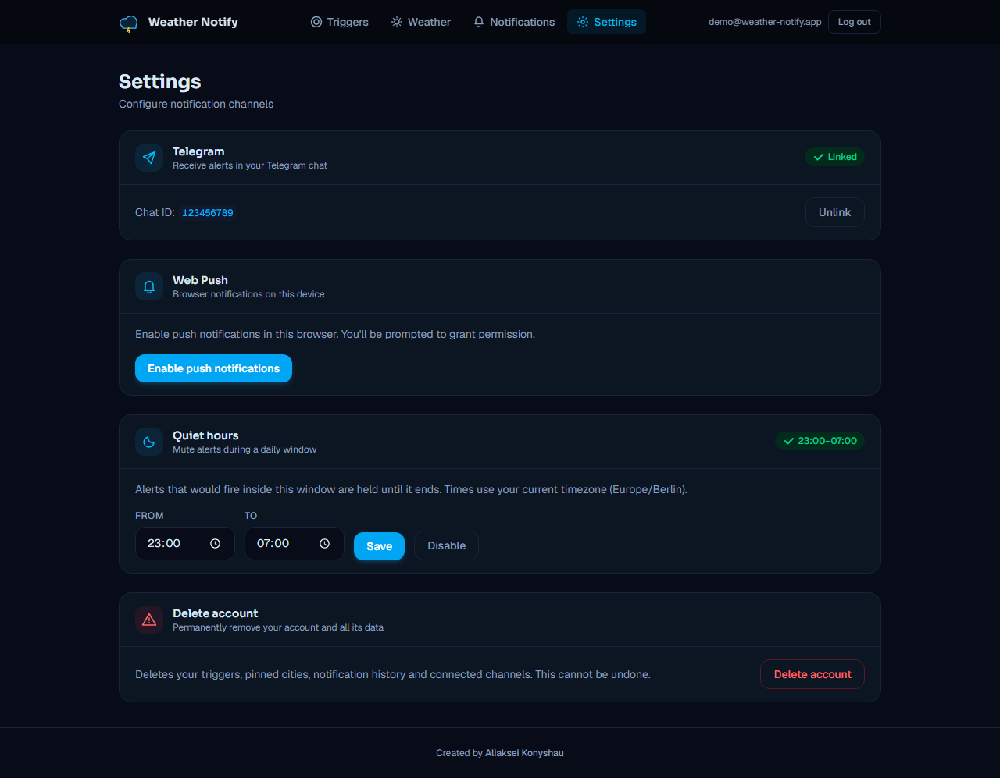
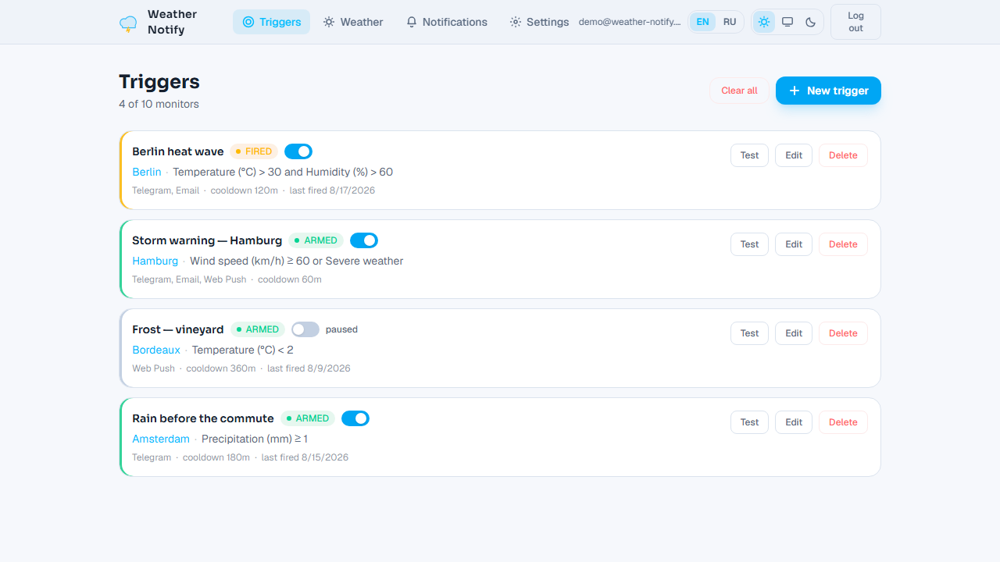
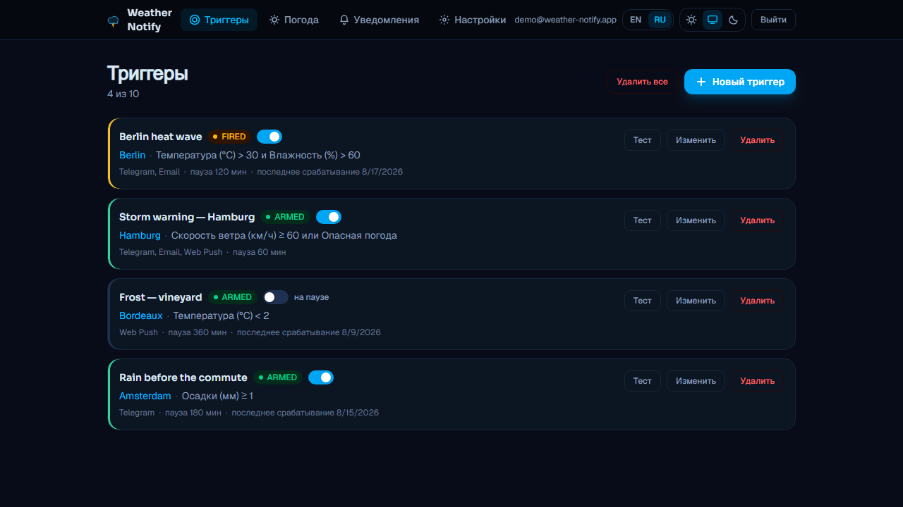

# Weather Notify — Web UI

Next.js frontend for the **Weather Notify** event-driven alerting system. Users sign in,
create weather triggers for any city, and manage delivery over Telegram, Email and Web Push.

> Backend (NestJS microservices) lives in a separate repository: `weather_notify`.



<details>
<summary>More screens — trigger builder, delivery history, forecast, settings</summary>






The same dashboard in the light theme and in Russian — both are the same
components, reading different tokens and a different catalogue:




</details>

Captured with `npm run screenshots`, which drives the production build against
a stubbed API — same cities, same timestamps and same delivery outcomes on
every run, so the images do not depend on whatever a live database happens to
hold.

## Features

- **JWT auth** with in-memory access token and silent refresh (Zustand + a single-flight axios interceptor)
- **Triggers dashboard** — create/edit/delete with **Open-Meteo** city autocomplete
- **Condition builder** — metric / operator / threshold, AND/OR logic, or a severe-weather preset
- **Notifications history** with per-channel delivery status
- **Settings** — link Telegram (deep link) and enable **Web Push** (service worker)
- **Password reset** and **account deletion**, both confirmed the way the API requires
- **Admin panel** (role-gated) — users, stats and trigger management
- **Light and dark themes**, following the OS by default, with no flash on load
- **English, Russian and Polish**, with real plural rules rather than a trailing "s"
- Responsive UI with email-verification banner and optimistic mutations

## Tech stack

Next.js 16 (App Router) · React 19 · TypeScript · Tailwind CSS v4 · Zustand ·
TanStack Query · react-hook-form + zod · axios · Vitest + Testing Library ·
Playwright.

## Theming and language

Both are the same shape, and neither uses a library.

**Theme** is three states — follow the OS, force light, force dark — because a
two-way toggle cannot express "follow the OS", and once it has written a
preference the user cannot get back to it. Only design tokens change: every
component keeps saying `bg-card` and `text-ink`, so the light palette is
thirteen redefinitions rather than a second stylesheet. `color-scheme` tracks
the same states, or a light page renders a dark date picker.

**Language** is English, Russian and Polish, in flat catalogues under
`src/i18n/messages`. Keys stay flat and fully qualified (`triggers.count`)
because that is how they read at call sites; the files are split by area, one
per section per language, so a string is edited where it belongs. `en` is the
source of truth: `MessageKey` derives from it, and each translated section is
typed against the English section of the same name — a forgotten key is a build
error in the file that forgot it, naming the key, rather than one unreadable
mismatch on the assembled catalogue.

Plurals go through `Intl.PluralRules`, which is the only way this works past
English. Russian needs запись / записи / записей and takes the singular at 21;
Polish needs alert / alerty / alertów and disagrees with Russian about 21 and
22. Neither is a rule you can spell as `count === 1`.

Both choices are read with `useSyncExternalStore` rather than copied into state
by an effect, which keeps several open tabs in step through the `storage`
event. A small script in `<head>` applies each before first paint: otherwise
every navigation renders in the wrong theme and snaps, and `<html lang>` would
claim English while the page shows Russian. That script reads `LOCALES`
rather than listing the codes, so a new language is announced correctly from
the first paint instead of after hydration.

## Rendering model

This is a **client-rendered SPA that happens to be built with Next**, and that is a
decision rather than an accident. Every screen behind the sign-in is per-user, live
and non-cacheable, and the API is a separate origin whose session cookie is scoped
to `/auth` — so a server component could not read it and a middleware guard could
not see it. Server rendering would buy nothing here that it does not first have to
be given.

What Next is still used for: the public pages (landing, sign-in, sign-up) render
on the server with their own metadata, the signed-in area is marked `noindex`, and
`next.config.ts` sends the security headers. Moving to a real RSC data flow means
first putting the API and the UI on one origin and widening the cookie's path —
until then, the honest shape is the one implemented here.

## Security

- The **refresh token** is never visible to JS — it lives in an `httpOnly` cookie set by the
  API. The **access token** is held in memory only: never in `localStorage`, so it cannot be
  read by injected script, and the session is restored from the cookie on load.
- **Security headers** (CSP, `X-Frame-Options`, `Referrer-Policy`, HSTS, `nosniff`,
  `Permissions-Policy`) are sent for every route via `next.config.ts`.
- All requests go through a hardened axios instance (`withCredentials`, timeout, refresh retry).

## Getting started

```bash
cp .env.example .env.local     # set NEXT_PUBLIC_API_URL (+ VAPID public key)
npm install
npm run dev                    # http://localhost:3001
```

The backend API must be running (default `http://localhost:3000`). See the backend repo
for `docker compose up`.

### Adding a language

Copy `src/i18n/messages/en/` to `src/i18n/messages/<code>/`, translate the
values, and add the code to `LOCALES` and `LOCALE_LABELS` in
`src/i18n/locales.ts`. Nothing else is wired by hand: the picker, the pre-paint
`<html lang>` script and the catalogue tests all read `LOCALES`, and the tests
run over every locale in it.

TypeScript names every key you have not translated yet, in the file that owes
it. If the language distinguishes plural categories English does not, add
`key_one` / `key_few` / `key_many` beside the bare key — the bare one is always
the `other` form, and the suite checks you added only forms the language
actually selects.

## Environment

| Variable                       | Description                                             |
| ------------------------------ | ------------------------------------------------------- |
| `NEXT_PUBLIC_API_URL`          | Core API base URL (also added to the CSP `connect-src`) |
| `NEXT_PUBLIC_VAPID_PUBLIC_KEY` | VAPID public key for Web Push (must match the backend)  |

> `NEXT_PUBLIC_*` vars are inlined at **build time** — set them before `next build`
> (in Vercel project settings, or as Docker build args for self-hosting).

## Testing

```bash
npm test          # Vitest unit/component tests (auth form, trigger form, api client)
npm run test:e2e  # Playwright, in a real browser against the production build
```

Two layers, because jsdom cannot show whether the app boots. The Vitest suites
cover validation, aria wiring and the axios client's refresh logic — the things
that are pure enough to assert without a browser.

Playwright covers what only a browser executes: routing, hydration, the session
bootstrap that runs before the first paint, and the redirect a guarded route
performs once it finishes. It runs against `next build` output rather than the
dev server, since that is what ships.

The API is stubbed per test with `page.route`, including the CORS headers a
cross-origin call actually needs — the backend proves its own behaviour against
a live Postgres in its repository, and what is unproven here is that this app
drives it correctly and renders what comes back.

```bash
npm run screenshots   # regenerate the README images
```

Screenshots are a third use of the same stubs: a fixed clock and fixed
fixtures, written into both repositories. Their config is separate from the
test project, so a copy change cannot fail CI over a stale image.

## Deployment

Deploy to **Vercel**: import the repo, set `NEXT_PUBLIC_API_URL` and
`NEXT_PUBLIC_VAPID_PUBLIC_KEY` in project settings, and ship. A `Dockerfile`
(Next.js standalone output) is included for self-hosting alongside the backend.

## Forking this

MIT licensed — see [LICENSE](LICENSE). The backend repository carries the
architecture decisions, the contributing guide and a walkthrough of what to
change to point the whole system at a different signal than weather
(`docs/using-this-as-a-template.md`).

One thing to change here after forking: CI checks out the API repository to
verify the generated client types still match `openapi.json`. Point it at your
own fork with the **`API_REPO`** repository variable (Settings → Secrets and
variables → Actions → Variables) rather than editing the workflow.

---

Created by [Aliaksei Konyshau](https://www.al-gres.com/).
